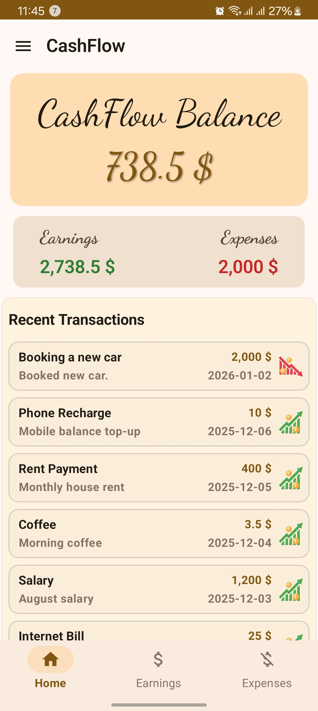
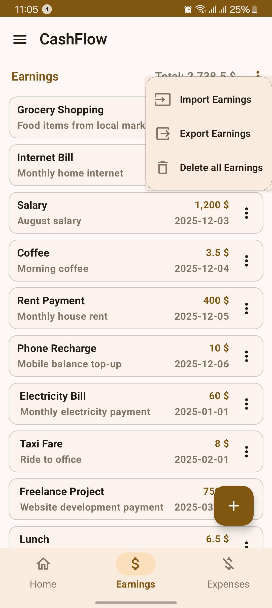
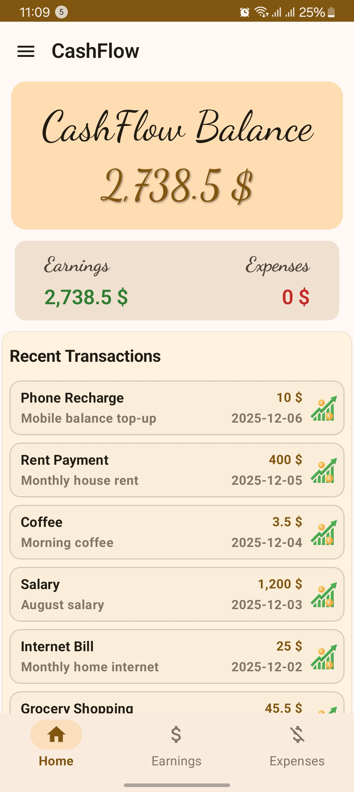
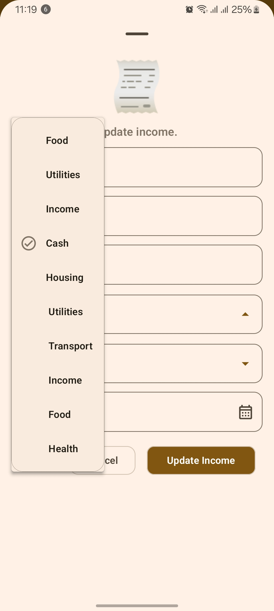

## Cashflow – Personal Finance Tracking App

Cashflow is a modern Android application designed to help users track their **incomes and expenses**, organize transactions by **categories and accounts**, and gain clear insights into their financial activity.
The app is built with **Jetpack Compose** and follows **MVVM architecture** with a clean and scalable structure.

------

#### ✨ Features

- 📥 **Income & Expense Management**
  - Add, edit, and delete transactions
  - Separate income and expense flows
- 🗂 **Category & Account Tracking**
  - Categorize transactions for better organization
  - Support for multiple accounts (cash, bank, etc.)
- 📊 **Financial Overview**
  - Total balance calculation
  - Income vs expense summaries
  - Recent transactions list
- 📤 **Export to Excel**
  - Export financial data to `.xlsx` files and import financial data from `.xlsx`  files.
  - Useful for reports and backups
- 🌙 **Modern UI**
  - Built entirely with Jetpack Compose
  - Material 3 design
  - Smooth and responsive layouts

------

#### 🛠 Tech Stack

- **Language:** Kotlin
- **UI:** Jetpack Compose, Material 3
- **Architecture:** Clean Architecture + MVVM
- **Data Storage:** Local database (Room) + repository
- **Export:** Excel (`.xlsx`) file generation
- **Tools:** Android Studio

------

#### 📸 Screenshots

|  |  |  |
| ------------------------------- | ------------------------------- | ------------------------------- |
|  |  |  |
|  |  |  |

------

#### 📌 Future Improvements

- 🔐 User authentication
- ☁️ Cloud sync & backup
- 📈 Charts and analytics
- 🌍 Multi-language support
- 🔔 Budget alerts and notifications